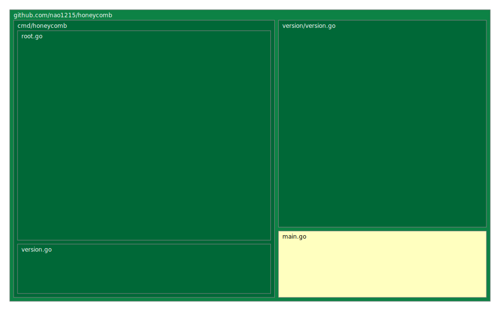

## Nostr client CLI application for cross-platform
<!-- ALL-CONTRIBUTORS-BADGE:START - Do not remove or modify this section -->
[](#contributors-)
<!-- ALL-CONTRIBUTORS-BADGE:END -->

> [!CAUTION]
> Work in progress. Not ready for production.
> Development just started on May 17, 2024. I plan to spend about one hour per day on the project.

Honeycomb is an application that uses the Nostr Protocol to post messages and view trends from the terminal. It is designed to offer both a Command Line Interface and a Text User Interface.

My main purposes for developing Honeycomb are the following:

To create a comfortable social network as an alternative to X (formerly Twitter) and BlueSky.
To serve as a testing ground for trying out new technologies.
I enjoy having a free environment and working in the terminal. Therefore, I intend to develop a user-friendly CLI.

## How to install
**go install**
```shell
go install github.com/nao1215/honeycomb@latest
```

**homebrew**
```shell
brew install nao1215/tap/honeycomb
```

## Supported platforms and requirements
- Linux
- macOS
- Windows
- go 1.20 or later

## How to use
Work in progress.

## Contributing
First off, thanks for taking the time to contribute! See [CONTRIBUTING.md](./CONTRIBUTING.md) for more information.  Contributions are not only related to development. For example, GitHub Star and [GitHub Sponsor](https://github.com/sponsors/nao1215) motivates me to develop!

**Star History**
[WIP]

**For Developers**
When adding new features or fixing bugs, please write unit tests. The homeycomb is unit tested for all packages as the unit test tree map below shows.




## Contact
If you would like to send comments such as "find a bug" or "request for additional features" to the developer, please use one of the following contacts.

- [GitHub Issue](https://github.com/nao1215/honeycomb/issues)

## License
This project is licensed under the MIT License - see the [LICENSE](./LICENSE) file for details.


## Contributors ✨

Thanks goes to these wonderful people ([emoji key](https://allcontributors.org/docs/en/emoji-key)):

<!-- ALL-CONTRIBUTORS-LIST:START - Do not remove or modify this section -->
<!-- prettier-ignore-start -->
<!-- markdownlint-disable -->
<table>
  <tbody>
    <tr>
      <td align="center" valign="top" width="14.28%"><a href="https://debimate.jp/"><br /><sub><b>CHIKAMATSU Naohiro</b></sub></a><br /><a href="https://github.com/nao1215/honeycomb/commits?author=nao1215" title="Code">💻</a> <a href="https://github.com/nao1215/honeycomb/commits?author=nao1215" title="Documentation">📖</a></td>
    </tr>
  </tbody>
  <tfoot>
    <tr>
      <td align="center" size="13px" colspan="7">
        
          <a href="https://all-contributors.js.org/docs/en/bot/usage">Add your contributions</a>
        </img>
      </td>
    </tr>
  </tfoot>
</table>

<!-- markdownlint-restore -->
<!-- prettier-ignore-end -->

<!-- ALL-CONTRIBUTORS-LIST:END -->

This project follows the [all-contributors](https://github.com/all-contributors/all-contributors) specification. Contributions of any kind welcome!
